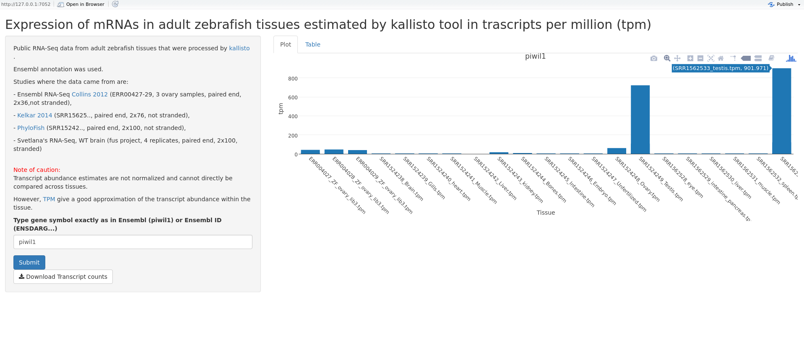

# Gene expression in public RNA-Seq data for adult Zebrafish tissues.

In which tissue my favorite gene is expressed?

I used [STAR](https://github.com/alexdobin/STAR) to map the publicly available RNA-Seq data and [Kallisto](https://github.com/pachterlab/kallisto) to quantify expression.

### Usage:

## Using interactive app:

Go to https://slebedeva.shinyapps.io/zebrafish-tissue-expression/ 

Deployment script is courtesy of Roel M. Hogervorst (https://www.r-bloggers.com/2021/02/deploy-to-shinyapps-io-from-github-actions/)

## If you have Rstudio installed locally:

Open Rstudio and type:
```{r}
library("shiny")
runGitHub("public_rnaseq_tpm","slebedeva")
```

Enter your gene as official gene symbol (case-sensitive!) (piwil1) or Ensembl gene name (ENSDARG...).
Mouse over the bar to see the sample and the TPM. The plot is showing total expression per gene.
You can also download the counts as a table.




